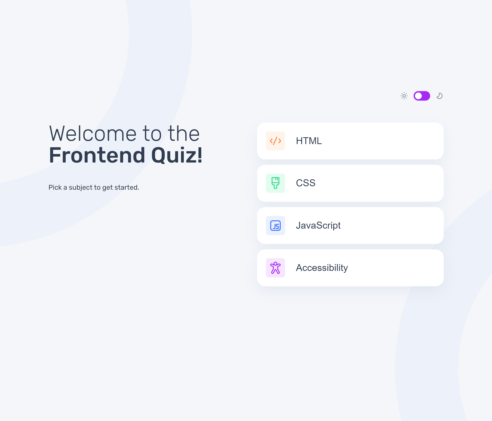
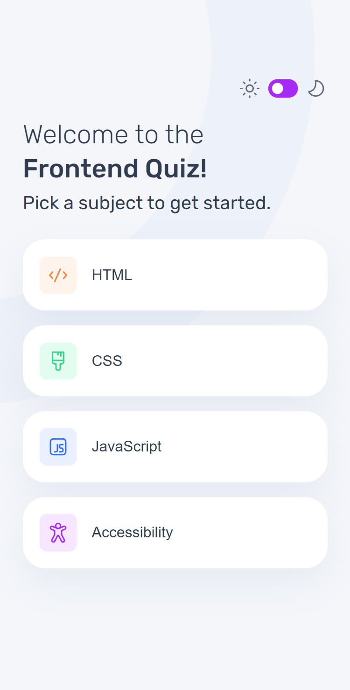
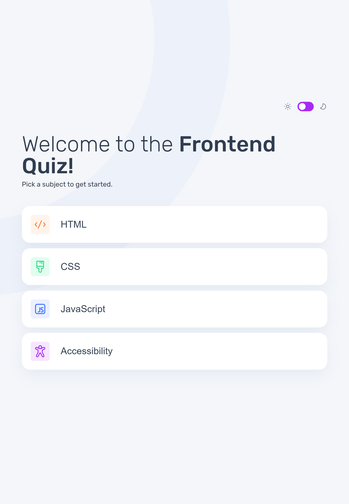

# Frontend Mentor - Frontend quiz app solution

This is a solution to the [Frontend quiz app challenge on Frontend Mentor](https://www.frontendmentor.io/challenges/frontend-quiz-app-BE7xkzXQnU). Frontend Mentor challenges help you improve your coding skills by building realistic projects. 

## Table of contents

- [Overview](#overview)
  - [The challenge](#the-challenge)
  - [Screenshot](#screenshot)
  - [Links](#links)
- [My process](#my-process)
  - [Built with](#built-with)
  - [What I learned](#what-i-learned)
  - [Continued development](#continued-development)
  - [Useful resources](#useful-resources)
- [Author](#author)
- [Acknowledgments](#acknowledgments)

**Note: Delete this note and update the table of contents based on what sections you keep.**

## Overview

### The challenge

Users should be able to:

- Select a quiz subject
- Select a single answer from each question from a choice of four
- See an error message when trying to submit an answer without making a selection
- See if they have made a correct or incorrect choice when they submit an answer
- Move on to the next question after seeing the question result
- See a completed state with the score after the final question
- Play again to choose another subject
- View the optimal layout for the interface depending on their device's screen size
- See hover and focus states for all interactive elements on the page
- Navigate the entire app only using their keyboard
- **Bonus**: Change the app's theme between light and dark


### Screenshot


| Desktop                        | Mobile               | Tablet |
| ------------------------------ | -------------------- | ---------------------- |
|  |  |  |


Add a screenshot of your solution. The easiest way to do this is to use Firefox to view your project, right-click the page and select "Take a Screenshot". You can choose either a full-height screenshot or a cropped one based on how long the page is. If it's very long, it might be best to crop it.

Alternatively, you can use a tool like [FireShot](https://getfireshot.com/) to take the screenshot. FireShot has a free option, so you don't need to purchase it. 

Then crop/optimize/edit your image however you like, add it to your project, and update the file path in the image above.

**Note: Delete this note and the paragraphs above when you add your screenshot. If you prefer not to add a screenshot, feel free to remove this entire section.**

### Links

- Solution URL: [frontend-quiz-app](https://www.frontendmentor.io/solutions/frontend-quiz-app-TCGgrRvY_G)
- Live Site URL: [frontend-quiz-app](https://emelinur.github.io/frontend-quiz-app/)

## My process

### Built with

- **HTML5 & CSS3**: Utilizing modern CSS variables and flex/grid layouts for responsiveness
- **Vanilla JavaScript**: Mastering DOM manipulation and asynchronous data fetching (fetch API)
- **JSON**: Managing quiz data through a structured local data file
- Semantic HTML5 markup
- CSS custom properties (CSS Variables)
- Flexbox & CSS Grid
- Mobile-first workflow
- Component-based logic architecture

### What I learned

This project wasn't just about writing code; it was about shifting my mindset towards modular and functional thinking.

**Component-Based Logic**: Even though I used Vanilla JavaScript, I approached the project with a "component mindset." Breaking the UI into manageable parts like the timer, options list, and result screen was a game-changer for my workflow.

**Functional Decomposition**: I learned how to separate concerns by delegating specific tasks to different functions (like `renderQuestion`, `startTimer`, and `handleTimeOut`). Controlling and managing different parts of the app independently was a unique and rewarding experience.

**State Management**: Handling the "state" of the quiz—tracking scores, current question indices, and selected answers—helped me understand how data flows through an application.

**DOM Caching & Performance Optimization**:
```js
// Cache DOM elements at the top to avoid repeated queries
const themeToggle = document.querySelector("#theme-toggle");
const optionsList = document.querySelector("#options-list");
const submitBtn = document.querySelector("#submitBtn");
// ... instead of querying the DOM multiple times in functions
```

**CSS Architecture**: Utilizing CSS variables and rem units instead of hardcoded pixel values, making the codebase more maintainable and responsive across different screen sizes.

**UI Fidelity**: Coming from a photography background, I took great pride in maintaining high design fidelity, ensuring that typography and spacing aligned with the original design tokens.

### Continued development

This challenge has significantly boosted my confidence. For future iterations:

- **React Framework Migration**: My next goal is to solve this same challenge using a JavaScript Framework/Library (like React) to see how these component concepts I've learned manually are handled in a more automated environment.
- **Advanced State Management**: Explore Redux or Context API for more complex state handling patterns.
- **Testing**: Implement unit tests and integration tests to ensure code reliability.
- **Accessibility Improvements**: Enhance keyboard navigation and screen reader support.
- **Performance Optimization**: Implement lazy loading for quiz data and optimize bundle size.

### Useful resources

- [Example resource 1](https://www.example.com) - This helped me for XYZ reason. I really liked this pattern and will use it going forward.
- [Example resource 2](https://www.example.com) - This is an amazing article which helped me finally understand XYZ. I'd recommend it to anyone still learning this concept.

**Note: Delete this note and replace the list above with resources that helped you during the challenge. These could come in handy for anyone viewing your solution or for yourself when you look back on this project in the future.**

## Author
- Frontend Mentor - [@Emelinur](https://www.frontendmentor.io/profile/Emelinur)
- Github - [@Emelinur](https://github.com/Emelinur)


## Acknowledgments

This is where you can give a hat tip to anyone who helped you out on this project. Perhaps you worked in a team or got some inspiration from someone else's solution. This is the perfect place to give them some credit.

**Note: Delete this note and edit this section's content as necessary. If you completed this challenge by yourself, feel free to delete this section entirely.**
